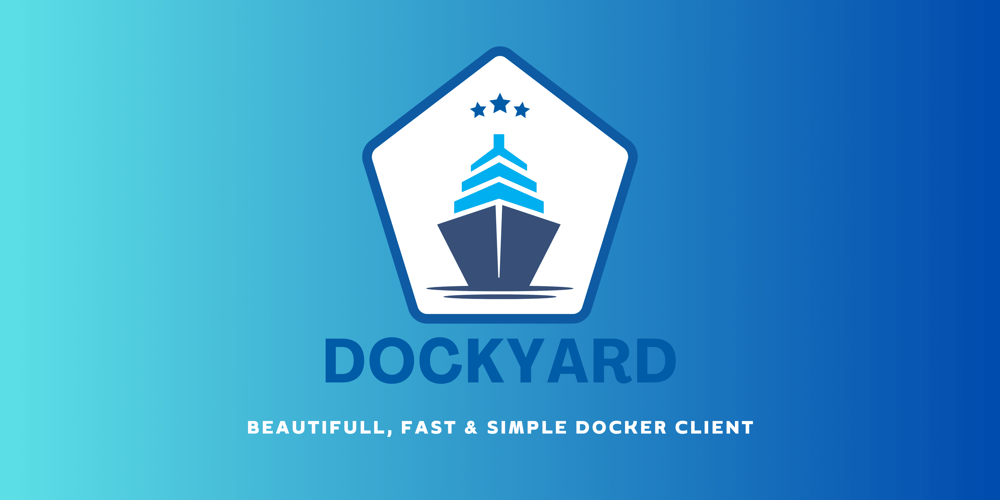

<h1 align="center">
  
</h1>
<p>
Dockyard is a modern, fast, and user-friendly Docker client designed to simplify container management on Linux. Built with Rust + Tauri and React.js, Dockyard offers a sleek interface and powerful features, making it easier than ever to work with Docker containers.
</p>


<div align="center">


[](https://github.com/ropali/dockyard/actions/workflows/release.yml)
[](https://www.rust-lang.org/)

</div>


<div align="center">

[](https://github.com/ropali/dockyard/releases) 
[](https://github.com/ropali/dockyard/releases) 
[](https://github.com/ropali/dockyard/releases)
[](https://github.com/ropali/dockyard/releases)


</div>


## Key Features

- **Intuitive UI**: A clean and simple interface designed for both beginners and advanced users.
- **Real-time Stats**: Monitor container stats in real-time with beautiful charts and graphs.
- **Container Management**: Easily start, stop, and remove containers with just a few clicks.
- **Terminal inside container**: Open shell inside the docker container using your favourite terminal app.
- **Log Viewer**: Integrated log viewer for real-time container logs with PatternFly support.
- **Fast Performance**: Built with Rust for speed and reliability.
- **Multi Themes**: Many themes to choose from.

## Screenshots


## Installation

### Prerequisites

- Linux/Mac
- [Tauri](https://v1.tauri.app/v1/guides/getting-started/prerequisites) (for development and building from source)
- Docker >=27.1.1 installed and running
- Node.js >= v20.11.1 (for development and building from source)
- Rust >= 1.79.0 (for building from source)

### Install Dockyard

You can download the latest release from [GitHub Releases](#) and install it using the following commands:

#### Using .deb file
```bash
# Download the latest .deb package
wget https://github.com/ropali/dockyard/releases/download/vX.Y.Z/dockyard_X.Y.Z_amd64.deb

# Install the package
sudo dpkg -i dockyard_X.Y.Z_amd64.deb

# If there are missing dependencies, run
sudo apt-get install -f

```


#### Using AppImage file
```bash
# Download the latest release
wget https://github.com/ropali/dockyard/releases/download/vX.Y.Z/dockyard-X.Y.Z.AppImage

# Make it executable
chmod +x dockyard-X.Y.Z.AppImage

# Run Dockyard
./dockyard-X.Y.Z.AppImage
```

#### MacOS Installation Issue
> [!NOTE]
> 
> Due to Apple's security policies, software without developer certification cannot be installed directly. To bypass this restriction, follow these steps:
> 
> - Click the Cancel button
> 
> - Go to System Preferences -> Security & Privacy
>
> - Click Open Anyway, and then click Open in the pop-up window. 
>
> If your system version is higher, you may not find the above options on the Security & Privacy page, or it may prompt that the file is damaged when you start it. then, you can bypass via terminal:
>
> - Open the terminal and execute the following command to authorize.
>
>```bash
>sudo xattr -d com.apple.quarantine /Applications/dockyard.app/
>```
>


### Build from Source

To build Dockyard from source, follow these steps:

```bash
# Clone the repository
git clone https://github.com/ropali/dockyard.git
cd dockyard

# Install dependencies
npm install

# Build the Rust backend
cargo build --release

# Run the app in development mode
npm run tauri dev
```

## Usage

Dockyard is designed to be simple and intuitive. Once installed, launch the application and start managing your Docker containers, volumes, and networks. 


## Contributing

We welcome contributions from the community! To get started:

1. Fork the repository.
2. Create a new branch (`git checkout -b feature/YourFeature`).
3. Make your changes.
4. Commit your changes (`git commit -am 'Add YourFeature'`).
5. Push to the branch (`git push origin feature/YourFeature`).
6. Open a Pull Request.


## Development Setup

To set up a development environment:

1. Clone the repository: `git clone https://github.com/ropali/dockyard.git`
2. Navigate to the project directory: `cd dockyard`
3. Install Node.js dependencies: `yarn install`
4. Build the Rust backend: `cargo build --release`
5. Run the app in development mode: `cargo tauri dev`

## Roadmap

- **Windows and macOS Support**: Extend Dockyard to support more operating systems.
- **Advanced Container Management**: Add features like container resource limits and custom network configurations.
- **Adavanced image management**: Add more operations related to image management.


## License

Dockyard is licensed under the [MIT License](LICENSE).

## Acknowledgements

- Built with [Tauri](https://tauri.app/), [React.js](https://reactjs.org/), and [Rust](https://www.rust-lang.org/).
- Inspired by my personal itch of creating a beautiful Docker Client(especially for Linux).

## Community

Follow me on [Twitter/X](https://twitter.com/ropali_munshi) for updates and discussions.

## Support

If you encounter any issues, please report them on [GitHub Issues](https://github.com/ropali/dockyard/issues) page.

